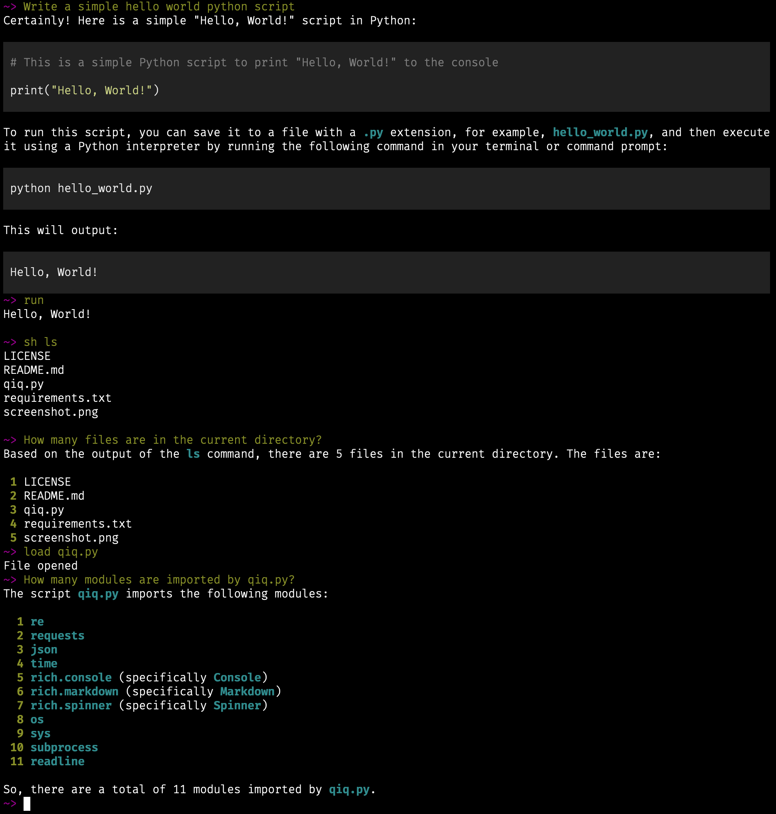

# sideqiq

A terminal chat powered by GPT-4o, requiring only a copilot subscription, with a few nice terminal features.
No OpenAI API key required - simply sign in with you Github Copilot-enabled account

## Installation
```
git clone https://github.com/B00TK1D/sideqiq
cd sideqiq
pip install .
```

## Usage
```
qiq
~> help
Special commands:
    load <filename>: Open a file and use it for future reference
    save <filename>: Save the last code block to a file
    sh <command>: Run a shell command (saves the output for future reference)
    run: Run the code from the last response
    clear: Clear the terminal and forget all previous messages
    exit: Exit chat
```

## Example



